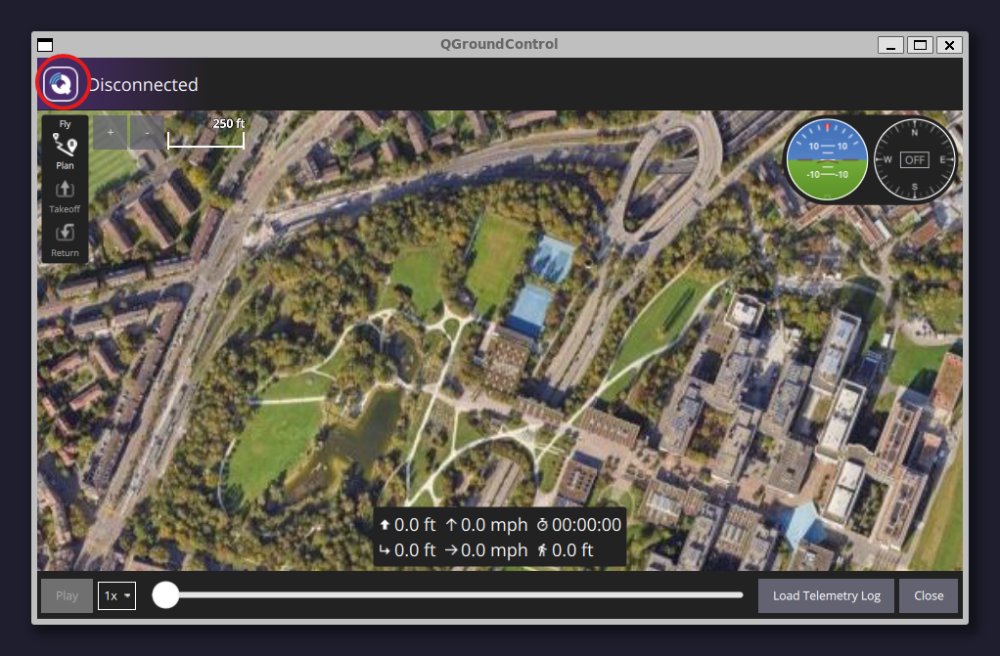
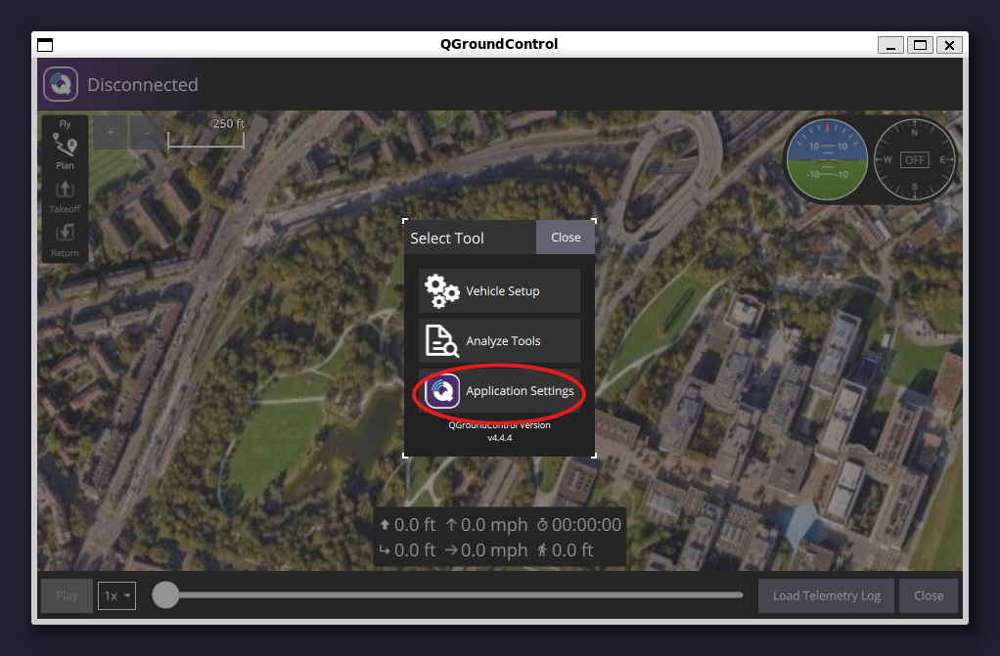
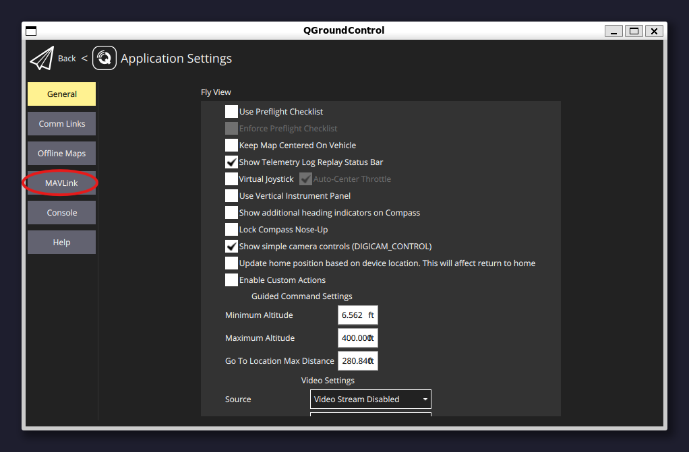
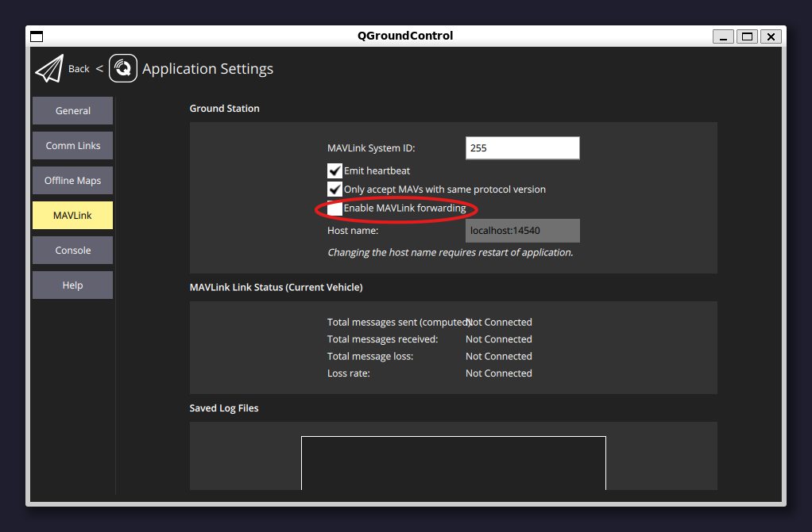
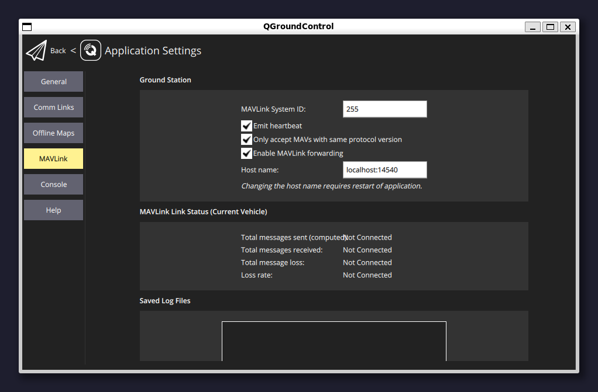
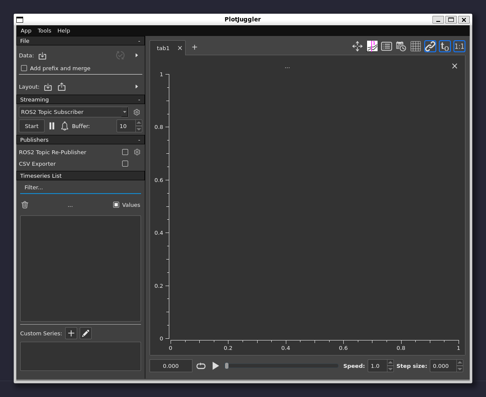

# Installation / Setup

### Prerequisites

Before you begin, ensure you meet the following requirements:

1. **Operating System**: Ubuntu 22.04 LTS
2. **Sudo Permissions**: You must have administrative privileges.
3.  **Required Packages**: Install the following packages using `apt`:

    ```bash
    sudo apt update && sudo apt install git wget curl make build-essential python3 python3-pip
    ```

***

:::warning
#### NOTE: Some commands may require user verification. Please accept or continue when prompted during execution.
:::

### Step 1: Install PX4 and ROS 2

1. **Set Up PX4 Environment**:
   1. Go to the [Install PX4](https://docs.px4.io/main/en/ros2/user_guide.html#install-px4) section.
   2. Scroll to "Set up a PX4 development environment on Ubuntu."
      1. Copy and paste the provided command block.
2. **Download and Install ROS 2**:
   * Go to the [Install ROS 2](https://docs.px4.io/main/en/ros2/user_guide.html#install-px4) section.
   * Follow steps one and two to install ROS 2 Humble. Note: This process may take several minutes.

Stop at the "Setup Micro XRCE-DDS Agent & Client" section.

***

### Step 2: Install MAVROS

To install MAVROS, follow the [official instructions](https://github.com/mavlink/mavros/blob/ros2/mavros/README.md#installation).

In my case, I used the following commands:

```bash
cd ~
sudo apt install ros-humble-mavros ros-humble-mavros-extras
wget https://raw.githubusercontent.com/mavlink/mavros/ros2/mavros/scripts/install_geographiclib_datasets.sh
sudo sh install_geographiclib_datasets.sh
```

***

### Step 3: Clone UROC ROS Node

To clone the UROC ROS node, copy and paste the following command block below into your terminal.

```bash
mkdir -p ~/ros2_ws/src
cd ~/ros2_ws/src
git clone https://github.com/cdenihan/UMD-UROC-ROS2-Python-Package
mv UMD-UROC-ROS2-Python-Package py_uroc
cd py_uroc
git config core.hooksPath .githooks
cd ..
cd ..
sudo rosdep init
rosdep update
rosdep install -i --from-path src --rosdistro humble -y
```

***

### Step 4: Download QGroundControl

Go to the [Ubuntu Linux](https://docs.qgroundcontrol.com/master/en/qgc-user-guide/getting_started/download_and_install.html#ubuntu) section and follow the steps up to the Android section.

Here are the commands I used:

```bash
sudo usermod -a -G dialout $USER
sudo apt-get remove modemmanager -y
sudo apt install gstreamer1.0-plugins-bad gstreamer1.0-libav gstreamer1.0-gl -y
sudo apt install libfuse2 -y
sudo apt install libxcb-xinerama0 libxkbcommon-x11-0 libxcb-cursor-dev -y
cd ~
curl -O https://d176tv9ibo4jno.cloudfront.net/builds/master/QGroundControl-x86_64.AppImage
chmod +x QGroundControl*.AppImage
```

Reboot your system to apply the user permission changes.

:::info
It is advised to download the AppImage into your home directory to match the steps these directions follow
:::

***

### Step 5: Enable Port Forwarding in QGroundControl

To enable port forwarding in QGroundControl:

1.  Launch QGroundControl:

    ```bash
    cd ~
    ./QGroundControl-x86_64.AppImage
    ```
2. Follow the steps in the screenshots below to enable port forwarding:







:::caution
Due to a recent QGroundControl UI update, the MAVLINK forwarding configuration is now located in the telemetry tab.
:::

You may now close QGroundControl.

***

### Step 6 (Option 1): Install PlotJuggler

Install PlotJuggler by following the [official instructions](https://github.com/facontidavide/PlotJuggler?tab=readme-ov-file#installation) for Ubuntu 22.04 with ROS2 support.

I used the following command:

```bash
sudo snap install plotjuggler
```

***

### Step 6 (Option 2): Set Up Foxglove

#### Part 1: Install Foxglove Desktop

To install Foxglove, use the instructions below:

:::tip
Download the latest tools from [Foxglove](https://foxglove.dev/download).
:::

I used these commands:

```bash
cd ~/Downloads
sudo apt install ./foxglove-studio-*.deb
sudo apt update && sudo apt install foxglove-studio
```

#### Part 2: Install Foxglove Bridge

Follow the instructions [here](https://docs.foxglove.dev/docs/connecting-to-data/ros-foxglove-bridge) to install Foxglove Bridge.

I ran this command:

```bash
sudo apt install ros-humble-foxglove-bridge
```

***

### Step 7: Test the Setup

Open four terminal windows and run the following commands in each:

#### Terminal 1: Start PX4 with Gazebo

```bash
cd PX4-Autopilot/
make px4_sitl gz_x500_gimbal
```

#### Terminal 2: Launch QGroundControl

```bash
cd ~
./QGroundControl-x86_64.AppImage
```

#### Terminal 3: Start MAVROS

```bash
ros2 run mavros mavros_node --ros-args -p fcu_url:=udp://:14540@127.0.0.1:14557 -p target_component_id:=1 -r __ns:=/mavros
```

***

#### Launch Foxglove or PlotJuggler

Depending on your needs, you may use either Foxglove or PlotJuggler.

To run Foxglove, use the following command in a fourth terminal:

```bash
cd ~/ros2_ws && colcon build --packages-select py_uroc && source install/local_setup.bash && ros2 launch py_uroc visualize.py
```

And in a fifth terminal:

```bash
ros2 launch foxglove_bridge foxglove_bridge_launch.xml
```

And lastly in a sixth terminal run this command

```bash
foxglove-studio "foxglove://open?ds=foxglove-websocket&ds.url=ws://localhost:8765/"
```

To run PlotJuggler, use this command in a fourth terminal:

```bash
plotjuggler
```

***

### Step 8: (PlotJuggler Only):

To visualize live data in PlotJuggler:

1. Click the **Start** button under the "Streaming" section on the left side of the screen.
2. Ensure "ROS Topic Subscriber" is selected.
3. Click the start button and select the desired topics to subscribe to.



***

### Step 9 (Optional): Use Helper Script

If you haven't noticed by now, you have to open a lot of terminals up. This can result in a mess appearing on your screen. To fix this a "helper script" was written. This script automates all of this into a single command.

Below is an example of how you would use this script:

```bash
# To start Foxglove data visualization tooling
python3 mavinsight.py --foxglove

# To start PlotJuggler data visualization tooling
python3 mavinsight.py --plotjuggler
```

#### Installation:

There isn't really an "installation" for this script. You are just downloading it to a location of your choice. In the steps below, we will be downloading it to our home directory ($HOME).

```bash
cd ~
curl -O https://raw.githubusercontent.com/cdenihan/MAVInsight/refs/heads/production/mavinsight.py
```

Then we can run the script as long as we are in our home directory and call it like demonstrated above.
